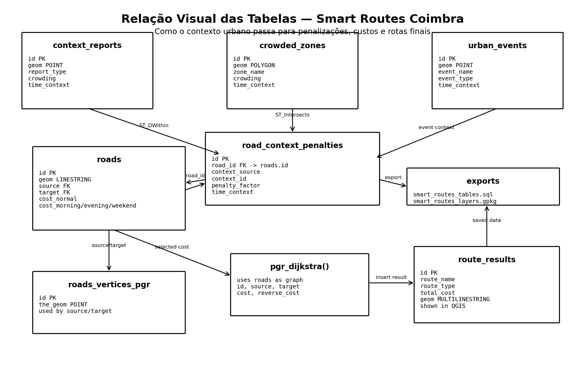

# Diagrama Visual da Base de Dados — Smart Routes Coimbra

Este ficheiro serve para explicar de forma visual como as tabelas principais da base de dados se ligam no projeto.

A ideia principal é simples:

```text
pontos e zonas de contexto
        ↓
penalizações nas estradas
        ↓
custos diferentes na tabela roads
        ↓
pgRouting calcula a rota
        ↓
route_results guarda o resultado
        ↓
QGIS mostra no mapa
```

---

## 1. Diagrama principal



---

## 2. Tabelas principais

### `roads`

Tabela central da rede viária.

Campos principais:

```text
id              PK
geom            geometria da estrada
source          nó inicial
target          nó final
highway         tipo de estrada
length_meters   comprimento
cost_normal     custo normal
cost_morning    custo de manhã
cost_evening    custo ao fim da tarde
cost_weekend    custo fim de semana/eventos
```

Esta tabela é a mais importante porque é usada diretamente pelo pgRouting.

---

### `roads_vertices_pgr`

Tabela de nós criada para o pgRouting.

Ligação lógica:

```text
roads.source -> roads_vertices_pgr.id
roads.target -> roads_vertices_pgr.id
```

Cada estrada começa num nó e termina noutro nó.

---

### `context_reports`

Tabela de pontos de contexto.

Exemplos:

```text
traffic
danger
transport
education
nightlife
event
```

A ligação com `roads` é feita por proximidade espacial.

```sql
ST_DWithin(roads.geom::geography, context_reports.geom::geography, 50)
```

Ou seja, se uma estrada estiver perto de um ponto de contexto, pode receber uma penalização.

---

### `crowded_zones`

Tabela de zonas congestionadas ou zonas com grande concentração.

Exemplos:

```text
Rua do Brasil
Portagem
Alma Shopping
Recinto Queima / Latada
```

A ligação com `roads` é feita por interseção espacial.

```sql
ST_Intersects(roads.geom, crowded_zones.geom)
```

Ou seja, se uma estrada passar dentro de uma zona congestionada, pode receber uma penalização.

---

### `urban_events`

Tabela de eventos urbanos ou académicos.

Exemplos:

```text
Queima das Fitas
Festa das Latas
eventos culturais
eventos académicos
```

Esta tabela ajuda a justificar zonas e custos do tipo:

```text
weekend
event
night
```

---

### `road_context_penalties`

Tabela intermédia que liga as estradas aos contextos.

Campos principais:

```text
id              PK
road_id         FK lógica para roads.id
context_source  origem do contexto
context_id      id do ponto/zona/evento
context_name    nome do contexto
context_type    tipo de contexto
crowding        nível de concentração
time_context    período em que afeta
penalty_factor  fator de penalização
reason          razão da penalização
geom            geometria da estrada afetada
```

Esta tabela responde à pergunta:

```text
Que estrada foi afetada, por que contexto, e com que penalização?
```

---

### `route_results`

Tabela final das rotas calculadas.

Campos principais:

```text
id
route_name
route_type
demo_name
origin_place
destination_place
total_cost
geom
created_at
```

É esta tabela que o QGIS mostra como camada de rotas.

---

## 3. Como as tabelas se ligam

```text
context_reports
      |
      | ST_DWithin com roads
      v

crowded_zones
      |
      | ST_Intersects com roads
      v

urban_events
      |
      | ajuda a justificar contexto/eventos
      v

road_context_penalties
      |
      | road_id = roads.id
      v

roads
      |
      | source / target ligados a roads_vertices_pgr
      v

pgr_dijkstra()
      |
      v

route_results
      |
      v

QGIS
```

---

## 4. Como os custos são aplicados

Primeiro, cada estrada tem o custo igual ao seu comprimento.

```text
cost_normal = length_meters
```

Depois, se a estrada tiver contexto, o custo pode aumentar.

Exemplo:

```text
length_meters = 100
cost_normal = 100
cost_evening = 175
```

Isto significa que a estrada tem 100 metros, mas no fim da tarde passa a ter custo 175, porque existe algum contexto que penaliza essa zona.

---

## 5. Lógica usada pela função principal

A função principal é:

```text
create_dynamic_route()
```

Ela faz isto:

```text
1. recebe origem e destino
2. procura o nó mais próximo da origem
3. procura o nó mais próximo do destino
4. escolhe a coluna de custo conforme o tipo de rota
5. executa pgr_dijkstra()
6. junta as geometrias das estradas usadas
7. guarda a rota em route_results
```

Escolha da coluna de custo:

```text
normal  -> cost_normal
morning -> cost_morning
evening -> cost_evening
weekend -> cost_weekend
```

---

## 6. Ligação com os ficheiros exportados

Foram criados dois ficheiros para facilitar a reprodução do projeto:

```text
database/smart_routes_tables.sql
exports/smart_routes_layers.gpkg
```

### `database/smart_routes_tables.sql`

Serve para recriar as tabelas principais em PostGIS.

Inclui:

```text
roads
context_reports
crowded_zones
urban_events
road_context_penalties
roads_vertices_pgr
route_results
```

### `exports/smart_routes_layers.gpkg`

Serve para abrir as camadas diretamente no QGIS.

Inclui:

```text
roads
context_reports
crowded_zones
urban_events
road_context_penalties
route_results
```

---

## 7. Frase curta para apresentação

```text
A tabela roads é a base da rede viária. As tabelas context_reports, crowded_zones e urban_events dão contexto à cidade. Esse contexto é convertido em penalizações na tabela road_context_penalties. Depois essas penalizações atualizam os custos em roads. A função create_dynamic_route escolhe o custo certo e o pgRouting calcula a rota final, que fica guardada em route_results e é visualizada no QGIS.
```
